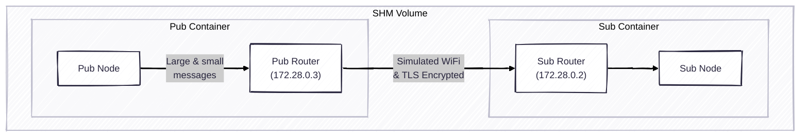

## Overview



## Usage

1. Download this repository and launch two containers

```bash
# Terminal 1
docker compose run sub
# Terminal 2
docker compose run pub
```

2. Build rmw_zenoh and the demo codes
In either pub/sub container
```bash
colcon build
```

3. Run pub and sub examples in each container
```bash
# Terminal 1
nu ./pubsub.nu --mode sub
# Terminal 2
nu ./pubsub.nu --mode pub
```


## Demo

- rmw_cyclonedds_cpp
```console
topic_1: 64 B, 63.3 Hz, 0.32 ms, loss: 0.00%, topic_2: 4 MB, 1.0 Hz, 345.71 ms, loss: 0.00%
topic_1: 64 B, 63.0 Hz, 0.33 ms, loss: 0.00%, topic_2: 4 MB, 1.0 Hz, 345.85 ms, loss: 0.00%
topic_1: 64 B, 62.8 Hz, 0.27 ms, loss: 0.00%, topic_2: 4 MB, 1.0 Hz, 345.69 ms, loss: 0.00%
topic_1: 64 B, 62.5 Hz, 0.32 ms, loss: 0.00%, topic_2: 4 MB, 1.0 Hz, 345.54 ms, loss: 0.00%
topic_1: 64 B, 62.8 Hz, 0.29 ms, loss: 0.00%, topic_2: 4 MB, 1.0 Hz, 345.41 ms, loss: 0.00%
```

- rmw_zenoh_cpp (default)
```console
topic_1: 64 B, 87.6 Hz, 6.38 ms, loss: 1.17%, topic_2: 0 B, 0.0 Hz, nan ms, loss: 100.00%
topic_1: 64 B, 88.5 Hz, 5.78 ms, loss: 1.14%, topic_2: 0 B, 0.0 Hz, nan ms, loss: 100.00%
topic_1: 64 B, 87.5 Hz, 6.41 ms, loss: 1.12%, topic_2: 0 B, 0.0 Hz, nan ms, loss: 100.00%
topic_1: 64 B, 88.8 Hz, 5.98 ms, loss: 1.11%, topic_2: 0 B, 0.0 Hz, nan ms, loss: 100.00%
topic_1: 64 B, 87.7 Hz, 5.85 ms, loss: 1.11%, topic_2: 0 B, 0.0 Hz, nan ms, loss: 100.00%
```

- rmw_zenoh_cpp (QoS used: Congestion control)
```console
topic_1: 64 B, 70.8 Hz, 8.25 ms, loss: 0.91%, topic_2: 4 MB, 1.0 Hz, 357.43 ms, loss: 0.00%
topic_1: 64 B, 82.6 Hz, 37.27 ms, loss: 0.94%, topic_2: 4 MB, 1.0 Hz, 356.66 ms, loss: 0.00%
topic_1: 64 B, 89.6 Hz, 56.61 ms, loss: 1.12%, topic_2: 4 MB, 1.0 Hz, 356.74 ms, loss: 0.00%
topic_1: 64 B, 89.7 Hz, 49.96 ms, loss: 1.11%, topic_2: 4 MB, 1.0 Hz, 357.35 ms, loss: 0.00%
topic_1: 64 B, 69.5 Hz, 7.60 ms, loss: 1.11%, topic_2: 4 MB, 1.0 Hz, 356.44 ms, loss: 0.00%
```

- rmw_zenoh_cpp (QoS used: Congestion control + Express)
```console
topic_1: 64 B, 71.7 Hz, 15.75 ms, loss: 1.01%, topic_2: 4 MB, 1.0 Hz, 355.85 ms, loss: 0.00%
topic_1: 64 B, 71.7 Hz, 16.87 ms, loss: 1.02%, topic_2: 4 MB, 1.0 Hz, 356.02 ms, loss: 0.00%
topic_1: 64 B, 71.8 Hz, 16.61 ms, loss: 1.02%, topic_2: 4 MB, 1.0 Hz, 356.60 ms, loss: 0.00%
topic_1: 64 B, 74.7 Hz, 14.87 ms, loss: 1.02%, topic_2: 4 MB, 1.0 Hz, 356.75 ms, loss: 0.00%
topic_1: 64 B, 69.6 Hz, 7.56 ms, loss: 1.02%, topic_2: 4 MB, 1.0 Hz, 357.06 ms, loss: 0.00%
```

- rmw_zenoh_cpp (compression enabeld)
```console
topic_1: 64 B, 93.4 Hz, 0.71 ms, loss: 0.00%, topic_2: 4 MB, 1.0 Hz, 10.33 ms, loss: 0.00%
topic_1: 64 B, 93.6 Hz, 0.64 ms, loss: 0.00%, topic_2: 4 MB, 1.0 Hz, 11.27 ms, loss: 0.00%
topic_1: 64 B, 93.4 Hz, 0.85 ms, loss: 0.00%, topic_2: 4 MB, 1.0 Hz, 10.87 ms, loss: 0.00%
topic_1: 64 B, 92.9 Hz, 0.85 ms, loss: 0.00%, topic_2: 4 MB, 1.0 Hz, 8.72 ms, loss: 0.00%
topic_1: 64 B, 93.0 Hz, 0.80 ms, loss: 0.00%, topic_2: 4 MB, 1.0 Hz, 7.52 ms, loss: 0.00%
```

- rmw_zenoh_cpp (shared memory enabeld)
```console
topic_1: 64 B, 93.7 Hz, 0.64 ms, loss: 0.00%, topic_2: 4 MB, 1.0 Hz, 1.24 ms, loss: 0.00%
topic_1: 64 B, 93.7 Hz, 0.65 ms, loss: 0.00%, topic_2: 4 MB, 1.0 Hz, 1.19 ms, loss: 0.00%
topic_1: 64 B, 93.5 Hz, 0.68 ms, loss: 0.00%, topic_2: 4 MB, 1.0 Hz, 1.69 ms, loss: 0.00%
topic_1: 64 B, 93.7 Hz, 0.56 ms, loss: 0.00%, topic_2: 4 MB, 1.0 Hz, 1.40 ms, loss: 0.00%
topic_1: 64 B, 93.8 Hz, 0.57 ms, loss: 0.00%, topic_2: 4 MB, 1.0 Hz, 1.15 ms, loss: 0.00%
```

## Appendix

See here to learn how to generate a proper CA.
https://zenoh.io/docs/manual/tls/#appendix-tls-certificates-creation
