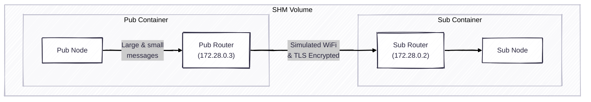

## Overview



## Usage

1. Download this repository and launch two containers

```bash
# Terminal 1
docker compose run sub
# Terminal 2
docker compose run pub
```

2. Build rmw_zenoh and the demo codes
In either pub/sub container
```bash
colcon build
```

3. Run pub and sub examples in each container
```bash
# Terminal 1
nu ./pubsub.nu --mode sub
# Terminal 2
nu ./pubsub.nu --mode pub
```


## Demo

- rmw_cyclonedds_cpp
```console
topic_1: 64 B, 63.0 Hz, 0.34 ms, topic_2: 4 MB, 1.0 Hz, 345.86 ms
topic_1: 64 B, 62.7 Hz, 0.28 ms, topic_2: 4 MB, 1.0 Hz, 345.70 ms
topic_1: 64 B, 62.4 Hz, 0.28 ms, topic_2: 4 MB, 1.0 Hz, 345.72 ms
topic_1: 64 B, 63.4 Hz, 0.31 ms, topic_2: 4 MB, 1.0 Hz, 345.74 ms
```

- rmw_zenoh_cpp (default)
```console
topic_1: 64 B, 87.3 Hz, 7.74 ms, topic_2: 0 B, 0.0 Hz, nan ms
topic_1: 64 B, 87.4 Hz, 7.44 ms, topic_2: 0 B, 0.0 Hz, nan ms
topic_1: 64 B, 87.4 Hz, 7.03 ms, topic_2: 0 B, 0.0 Hz, nan ms
topic_1: 64 B, 86.9 Hz, 7.24 ms, topic_2: 0 B, 0.0 Hz, nan ms
topic_1: 64 B, 87.1 Hz, 7.12 ms, topic_2: 0 B, 0.0 Hz, nan ms
```

- rmw_zenoh_cpp (QoS used)
```console
topic_1: 64 B, 92.9 Hz, 66.42 ms, topic_2: 4 MB, 1.0 Hz, 361.64 ms
topic_1: 64 B, 93.3 Hz, 64.15 ms, topic_2: 4 MB, 1.0 Hz, 360.33 ms
topic_1: 64 B, 93.2 Hz, 64.44 ms, topic_2: 4 MB, 1.0 Hz, 358.23 ms
topic_1: 64 B, 93.1 Hz, 65.36 ms, topic_2: 4 MB, 1.0 Hz, 361.04 ms
topic_1: 64 B, 93.0 Hz, 66.71 ms, topic_2: 4 MB, 1.0 Hz, 359.48 ms
```

- rmw_zenoh_cpp (compression enabeld)
```console
topic_1: 64 B, 91.1 Hz, 6.87 ms, topic_2: 4 MB, 1.0 Hz, 127.58 ms
topic_1: 64 B, 90.4 Hz, 6.07 ms, topic_2: 4 MB, 1.0 Hz, 124.68 ms
topic_1: 64 B, 90.5 Hz, 6.34 ms, topic_2: 4 MB, 1.0 Hz, 121.97 ms
topic_1: 64 B, 91.2 Hz, 6.42 ms, topic_2: 4 MB, 1.0 Hz, 124.53 ms
topic_1: 64 B, 90.8 Hz, 6.78 ms, topic_2: 4 MB, 1.0 Hz, 124.74 ms
```

- rmw_zenoh_cpp (shared memory enabeld)
```console
topic_1: 64 B, 93.4 Hz, 1.88 ms, topic_2: 4 MB, 1.0 Hz, 1.92 ms
topic_1: 64 B, 93.7 Hz, 1.89 ms, topic_2: 4 MB, 1.0 Hz, 2.98 ms
topic_1: 64 B, 92.9 Hz, 1.93 ms, topic_2: 4 MB, 1.0 Hz, 2.94 ms
topic_1: 64 B, 93.0 Hz, 1.85 ms, topic_2: 4 MB, 1.0 Hz, 2.78 ms
topic_1: 64 B, 93.4 Hz, 1.88 ms, topic_2: 4 MB, 1.0 Hz, 2.12 ms
```

## Appendix

See here to learn how to generate a proper CA.
https://zenoh.io/docs/manual/tls/#appendix-tls-certificates-creation
